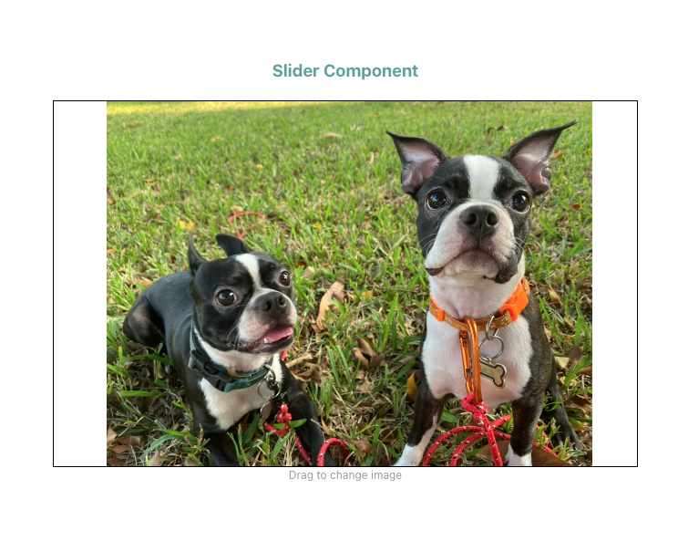

# Canvas Slides Component

This project was built using Typescript + React and Vite.

It creates a simple Slider component that can receive a list of images from different sources and create a draggable slider that uses the canvas to render the images.

## Getting started
To get the dev environment running you need to execute the following commands:

- `yarn install`
- `yarn dev`

This will get a running version on your local machine, with all the selected components already installed.

If you want to get a compiled version which can be distributed, just execute:
`yarn build`

And I'll generate a folder called `dist` which includes a minized version of the React runtime alongside the app with the component.

# Adding more images

To increase the list of images shown on the slider, all you need to do is to update the list being passed down on the main App,
it will automatically load those images on the slider and calculate the right size so that it can be properly embedded.
